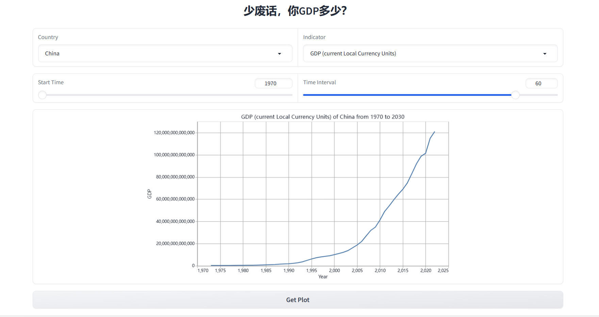
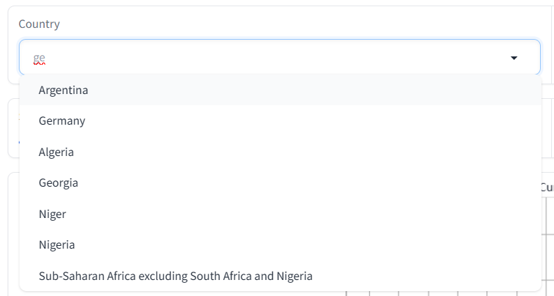

# Python深度学习实践Lab1
**罗浩铭 PB21030838**

## 项目地址
本项目已在github上开源，欢迎访问(https://github.com/4332001876/PythonDL_Lab1_Latest_Economic_Data_Analysis)


## 任务说明

我们借助爬虫实现了一个简单的GDP数据可视化工具，用户可以通过选择国家或地区、年份范围、统计口径来查看该国家或地区在该年份范围内的GDP变化折线图。



数据的获取由爬虫在世界银行数据API接口(https://api.worldbank.org/v2)获取，再将获取到的XML文本通过xml.etree.ElementTree库解析为Python对象。数据的获取实现了简单的缓存机制。界面的搭建通过gradio库实现。


## 实验细节（20 分）

代码实现的各部分如下，从底层类向上进行讲解：

### `config.py`

这里实现了一个静态类Config，用于指定爬虫header、爬虫爬取间隔时间、缓存路径。

### `crawler.py`

这里实现了Crawler类，其初始化函数为空，仅有一个功能函数。
该函数用于获取指定URL（字符串形式传入）的内容，以字符串形式返回。获取内容前会程序sleep一段时间（由`Config.SLEEP_TIME`指定，默认1秒），以防超过原网址访问频率限制，同时这个sleep时长不会对用户使用体验造成明显影响：
```python
class Crawler:
    def fetch_data(self, url):
```

### `db_field_manager.py`
本文件内实现了一个基类`FieldManager`与其两个子类`CountryFieldManager`与`IndicatorFieldManager`，用以统计国家与统计口径两字段内的选项，用于URL生成与实现选择栏。

```python
class FieldManager:
    """Used for managing the retrieval and searching of options within a field."""
    def __init__(self) -> None:

    def search(self, keyword):
        """Search for keyword in the dict."""

    def get_search_idx(self):
        """Get search index."""

    def get_drop_down_list(self):
        """Get drop down list for the field."""

class CountryFieldManager(FieldManager):
    """Used for managing the country name list."""

    def __init__(self) -> None:

    def get_countries_list(self):

    def get_countries_list_online(self):
        """Get countries list latest updated."""

class IndicatorFieldManager(FieldManager):
    """Used for managing the indicator name list."""
    def __init__(self) -> None:

    def get_indicators_list(self):
```

其中基类`FieldManager`定义了各字段都需要的功能：
- `search(self, keyword):` 用于以用户友好的国家地区名、统计口径名为查询关键词（从选择栏获取），返回其代码（通常为大写字母编号，较为复杂），这一代码用于生成URL
- `get_search_idx(self):`用于为上述搜索功能建立索引，应该在`__init__`函数内被调用
- `get_drop_down_list(self):`用于返回UI中选择栏的选项列表

`CountryFieldManager`子类中主要实现了获取国家列表的逻辑。由于国家及地区的列表通常在不断地更新，所以我们会从世界银行的在线API中获取最新的国家及地区列表。这里实现了一个在线获取国家及地区列表的函数`get_countries_list_online`，其通过爬虫在世界银行的API中获取XML列表，进行解析，并将各国家的默认代码、iso2代码、名字（用户友好）存进字典中，并将其缓存至临时文件夹的json文件中。而顶层的`get_countries_list`则会根据是否有本地缓存文件来决定是从本地缓存读取还是在线获取国家列表。

`IndicatorFieldManager`同样实现获取统计口径列表的逻辑。由于统计口径变化相对不大，我们将其写死在代码里，同样用一字典存储各统计口径代码和名字（用户友好）。


### `world_bank_data_interface.py`
文件中实现了`WbDataInterface`类，主要用于直接与世界银行的API交互并获取GDP数据，其API如下：
```python
class WbDataInterface:
    """Used for fetching GDP data from world bank api."""
    def __init__(self) -> None:

    def _get_url(self, country_name, indicator_name):
        """Get world bank api url for the specific country and indicator."""

    def get_data(self, country_name, indicator_name) -> pd.DataFrame:
        """Get data from world bank api by country name and indicator name."""
```
其各函数实现功能如下：
- `__init__(self) -> None:`主要用于实例化其依赖的`Crawler`、`CountryFieldManager`与`IndicatorFieldManager`类
- `_get_url(self, country_name, indicator_name):`是一个内部的函数，以选择栏选择的国家地区名、统计口径名为输入，借助字段管理类，返回数据所在的URL
- `get_data(self, country_name, indicator_name) -> pd.DataFrame:`是这个类最重要的API，以选择栏选择的国家地区名、统计口径名为输入，获取相应URL的XML数据，解析后返回`pandas.DataFrame`格式的GDP数据

### `server.py`
这里实现了`Server`类，主要用于生成用户界面，前端在这里显式地指定，后端已由`gradio`库实现，这里无需再实现。

```python
class Server:
    def __init__(self) -> None:

    def run(self):

    def build_page(self):
        """Build the page."""

    def get_plot(self, country_name, indicator_name, start_time, time_interval):
```

其实现函数如下：
- `def build_page(self):`用于搭建前端，指定前端样式
- `def get_plot(self, country_name, indicator_name, start_time, time_interval):`用于在用户按下`Get Plot`按钮时生成图像，其根据用户输入的国家或地区、年份范围、统计口径来获取GDP数据，并生成相应图像
- `def run(self):`启动后端服务器，提供网页服务

### `test.py`
实现了一个`Tester`类，封装了各测试函数，用于对程序各模块进行单元测试，主要供开发时使用。


### `main.py`
```python
from server import Server

def main():
    server = Server()
    server.run()

if __name__ == '__main__':
    main()
```

用于启动整个项目。

## 实验中遇到的难点与解决方案
本次实验主要是实现一个简单的爬虫应用，并不算难，因此遇到的困难不多。

主要遇到的困难有：
- 在选择GDP数据的获取来源时遇到了第一个卡点，IMF提供的数据接口较为复杂，不易使用，因此在经过一番对比之后，我最终选择了从世界银行API中获取数据
- 在解析XML时我遇到了第二个卡点，python的xml库的文档不够简明易懂，因此摸索其使用方式花费了不少时间
- gradio前端的部署由于我此前有经验，所以部署较为顺利，但其中存在一个BUG难以解决：拖动选择栏(gradio.Dropdown)的滚动条会导致页面无响应。这一BUG是gradio库的问题，已在几天前的Pull Request中解决(https://github.com/gradio-app/gradio/pull/5839)，但该版本尚未发布，目前仍需等待其最新版本发布。因此，使用当前界面时，选择栏的滚动条只能通过鼠标滚轮来控制，或者通过搜索功能来选取选项。


## 实验总结

我们实现了一个简单、功能强大、用户友好的GDP数据获取与可视化工具，用户只需通过简单友好的访问方式，就可以获取到精美直观可调整的GDP图像。可以说这一工具网站已经基本达到了实用的标准，未来这一项目可能会在我的服务器中部署。做出来这样一个项目可以说是成就满满。

这次实验麻雀虽小五脏俱全，我在其中完成了一个从后端到前端应有尽有的工程，可以说是锻炼了我的全栈能力。另外我在完成整个工程时也尽量遵守应有的代码规范以及相应的设计模式，可以说是很好地锻炼了我的软件工程能力。相信在这里锻炼到的工程能力将会在我未来实现AI大工程（使用现有AI项目AI库、衔接各大模块）的时候带来诸多裨益。


## 界面布局

我们设计的UI界面如下：


对界面的说明如下：
- 第一行的选择栏可以选择想要查看的国家或地区以及GDP的统计口径（总量/人均、本币/美元、现价/不变价）。**选择栏支持搜索功能**，可通过输入字符大幅减少候选项。



- 第二行的slider可以选择想要查看的年份范围。可以通过调整起始年份与时间跨度来控制年份范围（选择的年份范围超过数据里的年份范围时，展示的内容将仅有年份范围内有效数据。部分选项组合内可能没有有效数据，如欧盟肯定没有本币单位GDP，这时将只会返回一张空图像）。
- 设置完毕后，点击“Get Plot”按钮，即可在下方显示所选国家或地区的GDP折线图。图像可拖动或缩放，双击可复原。

注：界面使用gradio库搭建，其中存在一个BUG，拖动选择栏(gradio.Dropdown)的滚动条会导致页面无响应。这一BUG是gradio库的问题，已在几天前的Pull Request中解决(https://github.com/gradio-app/gradio/pull/5839)，但该版本尚未发布，目前仍需等待其最新版本发布。因此，使用当前界面时，选择栏的滚动条只能通过鼠标滚轮来控制，或者通过搜索功能来选取选项。


